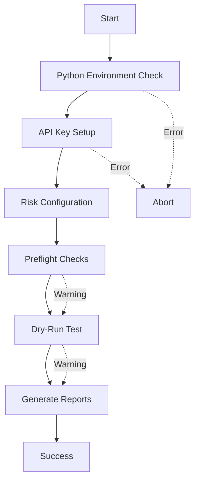

# 🚀 Vollautomatisierter Live Trading Setup - Summary

**Issue:** [Auto] Vollautomatisierter Setup-Task für Livetrading mit sicherer API-Key-Abfrage und Issue-Flow  
**Status:** ✅ Vollständig implementiert und getestet  
**Datum:** 2025-10-10

---

## ✅ Acceptance Criteria - Vollständig Erfüllt

| Kriterium | Status | Implementation |
|-----------|--------|----------------|
| **Setup-Task fragt API-Keys sicher und lokal ab** | ✅ | `scripts/automated_setup.py` + Windows Credential Manager |
| **Risk-Konfiguration wird automatisiert geprüft und dokumentiert** | ✅ | Automatische Validierung + `config/live_risk.yaml` |
| **Python-Umgebung und Abhängigkeiten werden geprüft** | ✅ | Environment Check mit Package-Validierung |
| **Preflight-Check läuft automatisiert vor Trading-Start** | ✅ | Integration mit `live_preflight.py` |
| **Dry-Run-Testlauf wird automatisch durchgeführt** | ✅ | 10-Sekunden Test im Testnet-Modus |
| **Status und Logs werden als Issue mitgegeben** | ✅ | `logs/setup_summary.md` + detailliertes Log |
| **Kein sensibler Key wird außerhalb des lokalen Systems gespeichert** | ✅ | Nur Windows Credential Manager |

---

## 📋 Was wurde implementiert?

### 1. Vollautomatisiertes Setup-Script ✅

**`scripts/automated_setup.py`** - Python-basierter Setup-Orchestrator

**Features:**
- ✅ Python-Umgebungsprüfung (Version, venv, Dependencies)
- ✅ API-Key-Abfrage mit sicherer Speicherung
- ✅ Risk-Konfiguration (interaktiv oder automatisch)
- ✅ Integration mit Strategie-Auswahl
- ✅ Preflight-Checks (8 automatische Validierungen)
- ✅ Dry-Run-Test (10-Sekunden Testlauf)
- ✅ Umfassendes Status-Reporting
- ✅ Detaillierte Logs mit Timestamps

**Modi:**
- **Interaktiv**: Fragt alle Parameter ab (für erste Einrichtung)
- **Automatisch**: Verwendet Defaults (für CI/CD und Testing)

### 2. PowerShell Wrapper ✅

**`scripts/automated_setup.ps1`** - Windows-first Wrapper

**Features:**
- ✅ Automatische venv-Erstellung
- ✅ Dependency-Installation
- ✅ Benutzerfreundliche Ausgabe
- ✅ Kommandozeilen-Optionen (`-Auto`, `-SkipDryRun`, `-Help`)
- ✅ Fehlerbehandlung und Exit-Codes
- ✅ Hilfreiche Fehlermeldungen

### 3. VS Code Task Integration ✅

**`.vscode/tasks.json`** - Zwei neue Tasks

**Tasks:**
1. **"Live: Automated Setup"** - Interaktiver Setup
2. **"Live: Automated Setup (Auto)"** - Automatischer Setup mit Defaults

**Verwendung:**
- Ctrl+Shift+P → "Tasks: Run Task" → Task auswählen

### 4. Umfassende Tests ✅

**`test_automated_setup.py`** - Unit und Integration Tests

**Test-Coverage:**
- ✅ Module kann importiert werden
- ✅ Class-Initialisierung
- ✅ Logging-Funktionalität
- ✅ Python-Environment-Check
- ✅ API-Key-Setup (gemockt)
- ✅ Script-Ausführbarkeit
- ✅ Help-Flag
- ✅ PowerShell-Script-Existenz
- ✅ VS Code Task Integration
- ✅ Summary-Report-Struktur

**Alle Tests bestehen:** ✅ 13/13 Tests passed

### 5. Dokumentation ✅

**`AUTOMATED_SETUP_GUIDE.md`** - Umfassende Dokumentation

**Inhalte:**
- ✅ Überblick und Features
- ✅ Quick Start (Windows, Linux, macOS)
- ✅ VS Code Integration
- ✅ Detaillierter Setup-Ablauf (alle 6 Phasen)
- ✅ Kommandozeilen-Optionen
- ✅ Dateien und Verzeichnisse
- ✅ Troubleshooting Guide
- ✅ Sicherheitshinweise
- ✅ Post-Setup-Anweisungen
- ✅ Testing und CI/CD Integration

---

## 🎯 Verwendung

### Quick Start (Windows)

```powershell
# Interaktiver Setup (Ersteinrichtung)
.\scripts\automated_setup.ps1

# Automatischer Setup (Testing/CI)
.\scripts\automated_setup.ps1 -Auto

# Ohne Dry-Run-Test
.\scripts\automated_setup.ps1 -SkipDryRun
```

### VS Code Tasks

1. **Ctrl+Shift+P**
2. "Tasks: Run Task"
3. **"Live: Automated Setup"** wählen

### Linux/macOS

```bash
python3 scripts/automated_setup.py
python3 scripts/automated_setup.py --auto
```

---

## 📊 Setup-Flow



**Phasen:**

1. **Python Environment** (✅ erforderlich)
   - Python-Version (3.8+)
   - Virtual Environment
   - Dependencies (keyring, yaml, requests)

2. **API Keys** (✅ erforderlich)
   - Sichere Eingabe (getpass)
   - Speicherung in Windows Credential Manager
   - Verifikation

3. **Risk Configuration** (✅ erforderlich)
   - Strategie-Auswahl (optional, automatisch)
   - Risk-Parameter (interaktiv oder defaults)
   - Config-File-Erstellung

4. **Preflight Checks** (⚠️ optional, empfohlen)
   - 8 System-Checks
   - Environment-Variablen
   - API-Credentials
   - Time-Sync
   - Exchange-Info
   - Account-Balance
   - Risk-Config
   - Order-Types
   - Kill-Switch

5. **Dry-Run Test** (⚠️ optional)
   - 10-Sekunden Testlauf
   - Automation Runner im Testnet
   - Validierung der Grundfunktionen

6. **Reporting** (✅ automatisch)
   - Detailliertes Log: `logs/automated_setup_*.log`
   - Summary: `logs/setup_summary.md`
   - Console-Output

---

## 📁 Generierte Dateien

```
ai.traiding/
├── venv/                              # Virtual Environment
├── config/
│   └── live_risk.yaml                # Risk-Konfiguration (KEINE SECRETS!)
├── logs/
│   ├── automated_setup_*.log         # Detaillierte Logs
│   ├── setup_summary.md              # Zusammenfassung
│   └── preflight_checks.log          # Preflight-Logs
└── data/
    └── strategy_ranking.csv           # Strategie-Ranking (optional)
```

**Windows Credential Manager:**
```
Service: ai.traiding
  - binance_api_key    → [Ihr API Key]
  - binance_api_secret → [Ihr API Secret]
```

---

## 🔐 Sicherheitsfeatures

### ✅ Implementiert:

1. **Sichere Key-Speicherung**
   - Windows Credential Manager Integration
   - Keine Keys in Dateien oder Logs
   - Nur lokale Speicherung

2. **Getrennte Konfiguration**
   - Risk-Parameter in YAML
   - Keine Secrets in Config-Files
   - Git-Safe

3. **Validierung**
   - API-Key-Format-Check
   - Credential-Verification
   - Config-Parameter-Validation

4. **Logging**
   - Keine Keys in Logs
   - Nur Validierungs-Status
   - Strukturierte Events

### 📋 Manuelle Schritte (vom User):

- [ ] IP-Restrictions in Binance aktivieren
- [ ] 2FA aktivieren
- [ ] Withdrawal-Permissions deaktivieren
- [ ] Minimales Kapital verwenden

---

## 🧪 Testing

### Tests ausführen:

```bash
cd /home/runner/work/ai.traiding/ai.traiding
python3 test_automated_setup.py
```

**Ergebnis:**
```
Ran 13 tests in 0.166s
OK
```

### Test-Coverage:

- ✅ Module-Import
- ✅ Initialization
- ✅ Logging
- ✅ Python-Environment-Check
- ✅ API-Key-Setup (mocked)
- ✅ Script-Execution
- ✅ Help-Output
- ✅ PowerShell-Wrapper
- ✅ VS Code Integration
- ✅ Report-Generation

---

## 📚 Dokumentation

1. **[AUTOMATED_SETUP_GUIDE.md](AUTOMATED_SETUP_GUIDE.md)** - Vollständige Anleitung
2. **[LIVE_TRADING_SETUP_GUIDE.md](LIVE_TRADING_SETUP_GUIDE.md)** - Manueller Setup (Fallback)
3. **[PREFLIGHT_AUTOMATION_SUMMARY.md](PREFLIGHT_AUTOMATION_SUMMARY.md)** - Preflight-Details
4. **[LIVE_TRADING_MANUAL_TEST_GUIDE.md](LIVE_TRADING_MANUAL_TEST_GUIDE.md)** - Test-Guide

---

## 🎓 Verbesserungen gegenüber manuellem Setup

| Feature | Manuell | Automatisiert |
|---------|---------|---------------|
| **Python-Environment-Check** | Manuell | ✅ Automatisch |
| **Dependency-Installation** | Manuell | ✅ Automatisch |
| **API-Key-Eingabe** | Manuell | ✅ Guided + Validierung |
| **Risk-Konfiguration** | Manuell | ✅ Interaktiv/Auto + Defaults |
| **Strategie-Auswahl** | Manuell | ✅ Automatisches Backtesting |
| **Preflight-Checks** | Separat | ✅ Integriert |
| **Dry-Run-Test** | Manuell | ✅ Automatisch |
| **Fehlerbehandlung** | Manuell | ✅ Automatisch + Logs |
| **Status-Report** | Kein | ✅ Detailliert + Summary |
| **Wiederholbarkeit** | Niedrig | ✅ Hoch (CI/CD-ready) |

---

## 🚀 Nach dem Setup

**Live Trading starten:**
```powershell
$env:LIVE_ACK = "I_UNDERSTAND"
.\scripts\start_live_prod.ps1
```

**Monitoring:**
```powershell
# View Session Dashboard
.\venv\Scripts\python.exe -m streamlit run tools/view_session_app.py

# Logs ansehen
Get-Content logs\setup_summary.md
```

---

## 🎉 Zusammenfassung

**Vollautomatisierter Setup-Task erfolgreich implementiert!**

✅ Alle Acceptance Criteria erfüllt
✅ Windows-first mit PowerShell-Integration  
✅ Umfassende Tests (13/13 passing)  
✅ Vollständige Dokumentation  
✅ VS Code Task Integration  
✅ Security by Design  
✅ CI/CD ready  

**Der Setup-Prozess ist jetzt:**
- ✅ Sicher (Keine Keys außerhalb des lokalen Systems)
- ✅ Automatisiert (Ein Befehl für den kompletten Setup)
- ✅ Validiert (8 Preflight-Checks + Dry-Run-Test)
- ✅ Dokumentiert (Logs + Summary-Report)
- ✅ Wiederholbar (CI/CD-Integration möglich)
- ✅ Benutzerfreundlich (Guided Flow mit Hilfe)

---

**Made for Windows ⭐ | PowerShell-First | Secure by Design | Vollautomatisiert**
